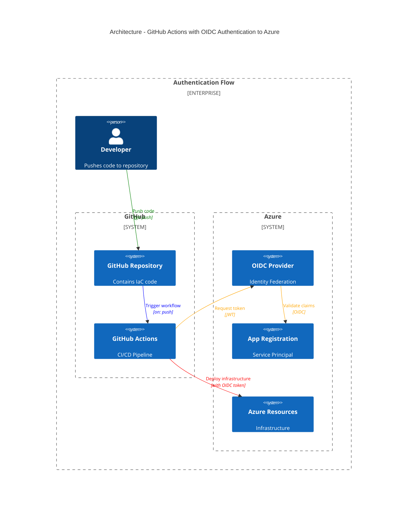

# Deploy IaC in Azure via GitHub actions using OIDC

This repository demonstrates how to deploy infrastructure using Terraform & Bicep to Azure through GitHub Actions, leveraging OpenID Connect (OIDC) for secure authentication.

## Overview

Integration between Azure and GitHub uses [OpenID Connect in Azure](https://learn.microsoft.com/en-us/azure/developer/github/connect-from-azure), which works with Azure's [workload identity federation](https://learn.microsoft.com/en-us/entra/workload-id/workload-identity-federation).

### Architecture



## Key resources

- [Configure OIDC provider in Azure](https://docs.github.com/en/actions/security-for-github-actions/security-hardening-your-deployments/configuring-openid-connect-in-azure) - sets up the OIDC provider in Azure to trust GitHub Actions
- [Subject claims for access control](https://docs.github.com/en/actions/security-for-github-actions/security-hardening-your-deployments/about-security-hardening-with-openid-connect#example-subject-claims) - allows restricting access tokens to specific branches, environments or events

## Create app registration and service principal

```bash
cd oidc/terraform

terraform init
terraform apply
```

## Define secrets in GitHub repository


