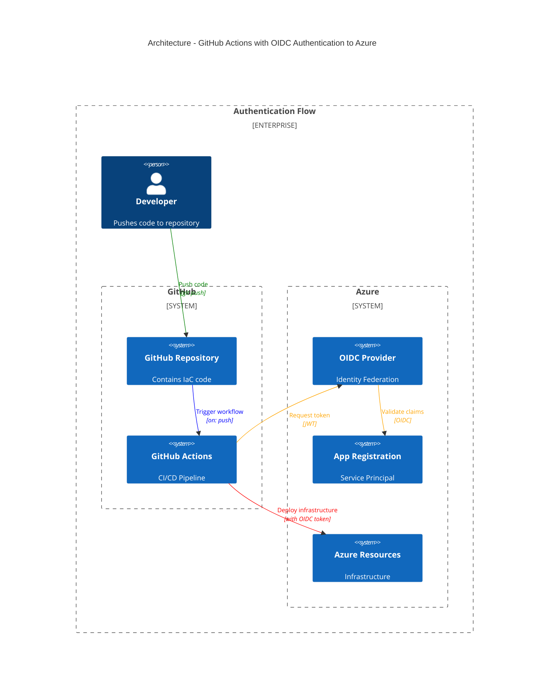
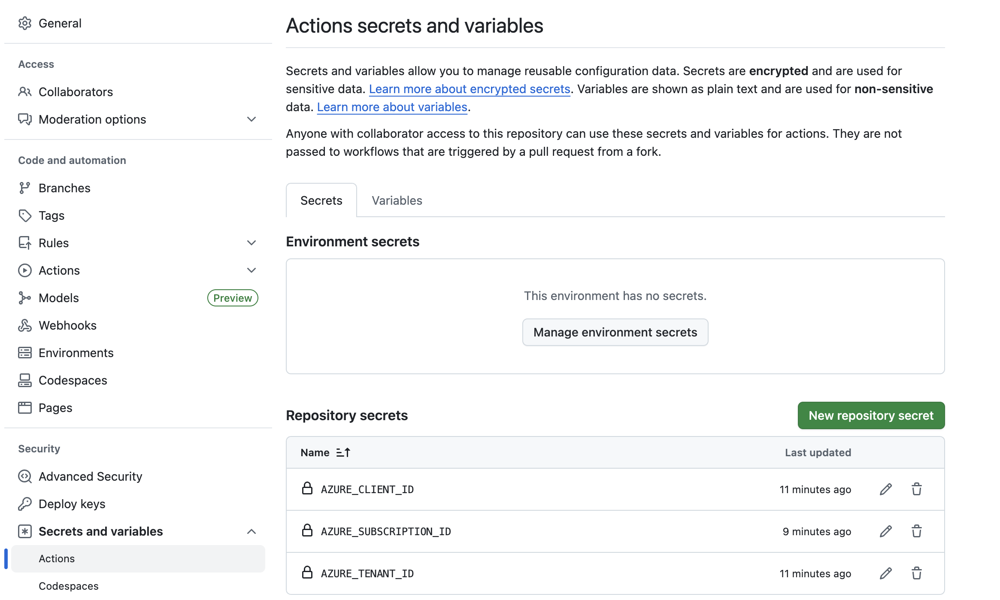

# Deploy IaC in Azure via GitHub actions using OIDC

This repository demonstrates how to deploy infrastructure using Terraform & Bicep to Azure through GitHub Actions, leveraging OpenID Connect (OIDC) for secure authentication.

## Overview

Integration between Azure and GitHub uses [OpenID Connect in Azure](https://learn.microsoft.com/en-us/azure/developer/github/connect-from-azure), which works with Azure's [workload identity federation](https://learn.microsoft.com/en-us/entra/workload-id/workload-identity-federation).

### Architecture



## Key resources

- [Configure OIDC provider in Azure](https://docs.github.com/en/actions/security-for-github-actions/security-hardening-your-deployments/configuring-openid-connect-in-azure) - sets up the OIDC provider in Azure to trust GitHub Actions
- [Subject claims for access control](https://docs.github.com/en/actions/security-for-github-actions/security-hardening-your-deployments/about-security-hardening-with-openid-connect#example-subject-claims) - allows restricting access tokens to specific branches, environments or events

## Create app registration and service principal

### Prerequisites

```bash
az login
```

### Bicep

```bash
cd oidc/bicep

az deployment sub what-if \
  --location westeurope \
  --name oidc-bicep \
  --template-file main.bicep \
  --parameters parameters.json

az deployment sub create \
  --location westeurope \
  --name oidc-bicep \
  --template-file main.bicep \
  --parameters parameters.json
```

Links:
* [Bicep best practices](https://learn.microsoft.com/en-us/azure/azure-resource-manager/bicep/best-practices)
* [Example - subscription role assignment](https://github.com/Azure/azure-quickstart-templates/blob/master/subscription-deployments/subscription-role-assignment/main.bicep)
* [Role assignments in Bicep](https://learn.microsoft.com/en-gb/azure/templates/microsoft.authorization/roleassignments?pivots=deployment-language-bicep)
* [Quickstart: Create and deploy your first Bicep file with Microsoft Graph resources](https://learn.microsoft.com/en-gb/graph/templates/bicep/quickstart-create-bicep-interactive-mode?tabs=CLI)
* [msgraph-bicep-types - quickstart-templates](https://github.com/microsoftgraph/msgraph-bicep-types/tree/main/quickstart-templates)
* [Configure federated identity credential for GitHub Actions](https://github.com/microsoftgraph/msgraph-bicep-types/blob/main/quickstart-templates/create-fic-for-github-actions/README.md)

### Terraform

```bash
cd oidc/terraform

terraform init
terraform apply
```

## Define secrets in GitHub repository


